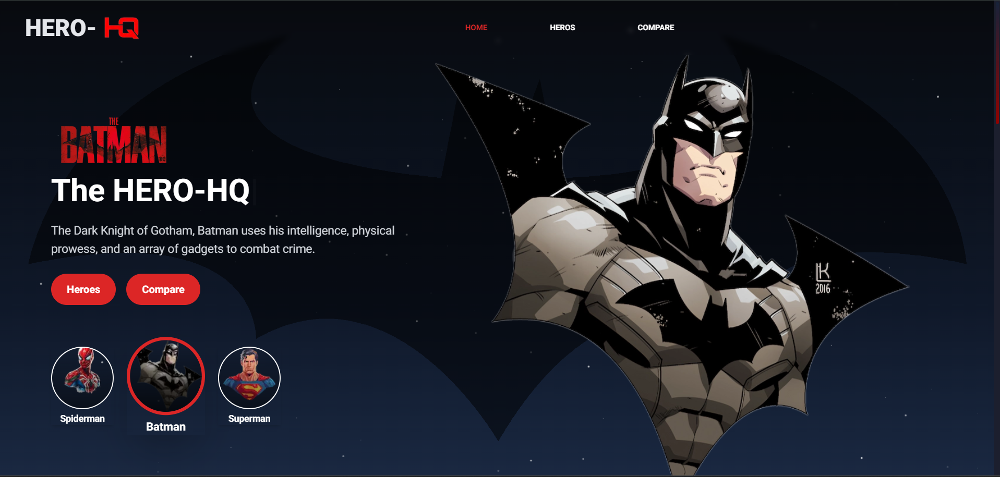

# Hero HQ

 


**Hero HQ** is a dynamic web application where users can explore details about various superheroes and compare them side by side. The comparison feature includes visual graphs of power stats, height, and a win probability indicator to help users determine the likely winner in a hypothetical match-up.

## Features

- **Superhero Details**: 
  - View detailed information about individual superheroes, including their biography, power stats, history and images.
  
- **Superhero Comparison**:
  - Compare two superheroes by selecting them from a list. The comparison includes:
    - **Power Stats Graph**: Visual representation of the superheroes' power stats such as strength, speed, durability, power, combat, and intelligence.
    - **Height Comparison**: Graph comparing the heights of the selected superheroes.
    - **Win Probability**: An indicator showing the likely winner based on various factors.

## Technologies Used

- **Frontend**:
  - Next.js
  - TypeScript
  - Tailwind CSS
  - Framer Motion
  - recharts (for graph visualizations)

- **Data Source**:
  - Superhero API: Used to fetch superhero data. [Superhero API](https://akabab.github.io/superhero-api/api/)

## Getting Started

### Prerequisites

- Node.js
- npm or yarn

### Installation

1. **Clone the Repository**

    ```bash
    git clone https://github.com/your-username/monster-pedia.git
    cd monster-pedia
    ```

2. **Install Dependencies**

    ```bash
    pnpm install
    ```

3. **Run the Development Server**

    ```bash
    pnpm dev
    ```

4. **Open Your Browser**

    Visit `http://localhost:3000` to see the application in action.

## Contributing

If you'd like to contribute to HERO-HQ, please follow these guidelines:

1. **Fork the Repository**
2. **Create a New Branch**: `git checkout -b feature/your-feature`
3. **Commit Your Changes**: `git commit -am 'Add some feature'`
4. **Push to the Branch**: `git push origin feature/your-feature`
5. **Open a Pull Request**

## Contact

For any questions or feedback, feel free to reach out to me:

- **GitHub**: [Mihir Jaiswal](https://github.com/MihirJaiswal/MihirJaiswal)
- **Email**: jaiswalmihir.business@gmail.com
- **LinkedIn**: [Mihir Jaiswal](https://www.linkedin.com/in/mihir-jaiswal-322898287/)